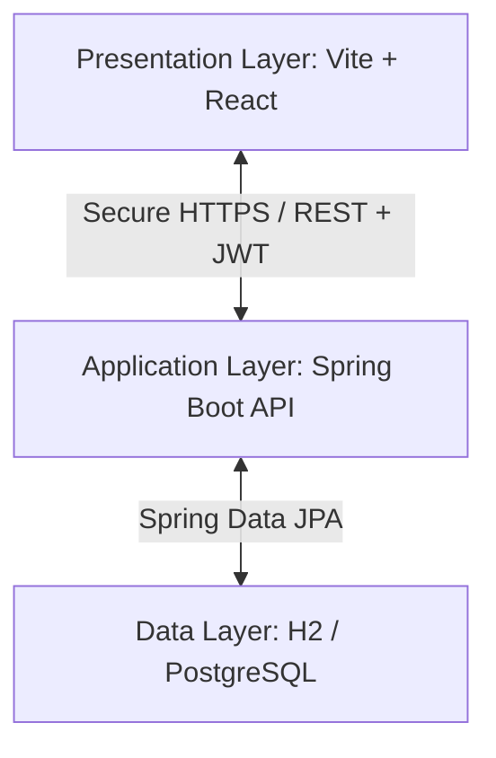

# 📊 Architect Ledger — Enterprise Finance Dashboard

[](https://expense-tracker-jade-sigma-55.vercel.app/)
[](https://expense-tracker-4ngx.onrender.com/)
[](#)
[](#)

A secure, high-performance, full-stack financial dashboard designed to track, manage, and visualize corporate income, expenses, and transaction logs. This application features a decoupled architecture with a **Spring Boot 3 REST API** backend and a **Vite + React** single-page application frontend.

---
## ✨ Features

- 🔐 **Stateless Authentication**: Secure user registration and login endpoints utilizing JSON Web Tokens (JWT).
- 📈 **Interactive Analytics**: Rich dashboard visuals featuring real-time financial tracking (Total Income, Expenses, Net Balance) with responsive charts.
- 💼 **Transaction Ledger**: Structured CRUD operations for financial records, categorized dynamically for smart spending tracking.
- 🛡️ **Role-Based Access Control (RBAC)**: Strict authorization layers across three user roles:
  - `ADMIN`: Overarching management, user control, and audit logs.
  - `ANALYST`: Transaction monitoring, logs access, and report views.
  - `VIEWER` (Default): Personal transaction tracking and read-only reports.
- 📝 **Automated Audit Logging**: Persistent event tracking recording sensitive administrative actions in a dedicated audit database.
- ⚙️ **User Configuration**: User profile configurations, password rotation, and role assignment.

---

## 🏗️ System Architecture

The application adopts a standard **3-Tier Architecture**:



- **Frontend**: Single-Page Application (SPA) utilizing Axios Interceptors to attach `Authorization: Bearer <token>` headers to API requests. Managed via React Router DOM.
- **Backend**: Structured Controller-Service-Repository pattern. Features `@Transactional` data protections and global security filters.
- **Database**: Supports seamless database transitions (H2 for in-memory development, PostgreSQL/MySQL for production deployments).

---

## 🛠️ Tech Stack

### Frontend
- **Framework**: React 18 (Vite build system)
- **Routing**: React Router DOM v6
- **HTTP Client**: Axios
- **Charts & UI**: Recharts, Lucide React
- **Styling**: Tailored Vanilla CSS with interactive micro-animations

### Backend
- **Framework**: Spring Boot 3.2.3
- **Security**: Spring Security & JSON Web Tokens (JJWT 0.12.5)
- **Data Mapper**: Spring Data JPA (Hibernate)
- **Database**: H2 In-Memory / PostgreSQL / MySQL
- **Language Compatibility**: Java 21 & Java 24 (Lombok 1.18.38)

---

## ⚙️ Environment Configurations

Configure these environment variables in your deployment platform (Vercel, Render, Heroku) or your local `.env` configuration.

### Backend Variables (Render)
| Environment Variable | Description | Default |
| :--- | :--- | :--- |
| `PORT` | Web server listening port | `8080` |
| `ALLOWED_ORIGINS` | Allowed CORS frontend origins | `http://localhost:5173` |
| `JWT_SECRET` | Secure key for JWT signature (Base64 or String) | *(Generated Default)* |
| `DATABASE_URL` | PostgreSQL connection URL (`postgres://...`) | *(H2 In-Memory fallback)* |

### Frontend Variables (Vercel)
| Environment Variable | Description | Example |
| :--- | :--- | :--- |
| `VITE_API_BASE_URL` | Backend URL target for REST API | `https://expense-tracker-4ngx.onrender.com` |

---

## 🚀 Getting Started

### Prerequisites
- **Java JDK 21+** (fully compatible with Java 24)
- **Node.js v18+** & npm
- **Maven 3.8+** (a local Maven wrapper is included in the workspace)

### 1. Run the Backend locally
1. Navigate to the backend folder:
   ```bash
   cd backend
   ```
2. Build and package the project:
   ```bash
   mvn clean install -DskipTests
   ```
3. Run the Spring Boot application:
   ```bash
   mvn spring-boot:run
   ```
   *The backend will be available at `http://localhost:8080` (or the configured `PORT`).*

### 2. Run the Frontend locally
1. Navigate to the frontend folder:
   ```bash
   cd frontend
   ```
2. Install dependencies:
   ```bash
   npm install
   ```
3. Start the Vite development server:
   ```bash
   npm run dev
   ```
   *The frontend will run at `http://localhost:5173`.*

---

## ☁️ Cloud Deployment

For detailed deployment parameters, credentials parsing, and database linking steps, see the included [Deployment Guide](deployment_instructions.md).

> [!TIP]
> **Production Recommendation:** 
> When deploying to **Vercel** + **Render**, always link a free database like **PostgreSQL (Neon.tech)** to avoid losing your data during Render's inactive service restarts.
